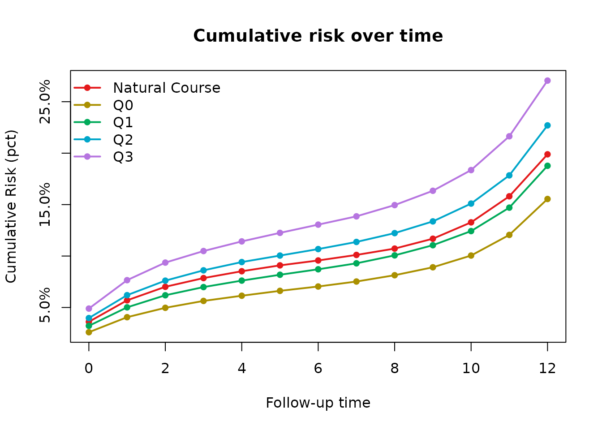
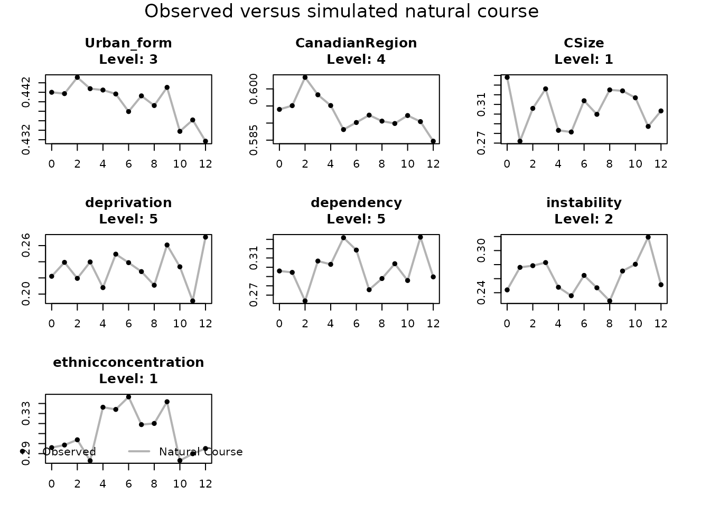

# Complete tvcQGComp analysis workflow

## Overview

`tvcQGComp` estimates the survival effect of joint interventions on a
quantized time-varying exposure mixture. The core workflow is:

1.  arrange the observed data in long person-period format;
2.  define the outcome, exposures, covariates, histories, and estimand;
3.  validate the data against that configuration;
4.  generate quantized intervention scenarios;
5.  run Monte Carlo g-computation; and
6.  interpret the point estimates and risk trajectories;
7.  inspect run-level and natural-course diagnostics; and
8.  use a subject-level bootstrap for confidence intervals.

This public release focuses on main-effect survival analyses with
quantized exposures.

## Required data structure

The input must contain one row per subject and follow-up interval. At
minimum, the configured columns must identify:

| Role | Example |
|----|----|
| Subject identifier | `UniqID` |
| Interval start and end | `TimeInn`, `TimeOut` |
| Interval event indicator | `status` |
| Time-varying exposures | `BC`, `NIT`, `SO4`, `NH4`, `OM` |
| Time-varying covariates | `CSize`, `Urban_form`, `CanadianRegion`, neighborhood indices |
| Baseline covariates | `sex`, education, employment, and other demographic variables |

Subject identifiers and interval times should uniquely identify rows.
Base variables used by model formulas must be present, correctly typed,
and supported at every time required by the simulation. Lagged formula
terms do not need to be stored in the input when `auto_history = TRUE`.

## Configure the analysis

The package includes the complete `toy_data` dataset used in this
example.

``` r

library(tvcQGComp)

data("toy_data", package = "tvcQGComp")
dat <- toy_data
dat$TimeOut <- as.integer(as.character(dat$TimeOut))

dim(dat)
#> [1] 5584   28
head(dat[c("UniqID", "TimeInn", "TimeOut", "status", "BC", "NIT")])
#>   UniqID TimeInn TimeOut status     BC    NIT
#> 1      1       0       1      0 1.5651 1.1343
#> 2      1       1       2      0 0.9162 1.4713
#> 3      1       2       3      0 1.3029 1.5075
#> 4      1       3       4      0 1.0494 1.8727
#> 5      1       4       5      0 1.6890 1.2471
#> 6      1       5       6      0 0.4933 1.8635

exposures <- c("BC", "NIT", "SO4", "NH4", "OM")
active_tvc <- c(
  "Urban_form", "CanadianRegion", "CSize", "deprivation",
  "dependency", "instability", "ethnicconcentration"
)
baseline <- c(
  "age", "income_inadequacy", "sex", "visible_minority",
  "IndigenousIdentity", "marsth", "Education", "employment", "Occupation"
)

# These are formula term names only. auto_history creates the columns.
active_lag_terms <- paste0(active_tvc, "_lag1")
tvc_formulas <- setNames(lapply(active_tvc, function(response) {
  reformulate(
    c(
      "TimeOut", "I(TimeOut^2)", baseline,
      setdiff(active_lag_terms, paste0(response, "_lag1"))
    ),
    response = response
  )
}), active_tvc)

exposure_lag_terms <- paste0(exposures, "_lag1")
exposure_formulas <- setNames(lapply(exposures, function(response) {
  reformulate(
    c(
      "TimeOut", "I(TimeOut^2)", baseline, active_tvc,
      exposure_lag_terms
    ),
    response = response
  )
}), exposures)

cfg <- make_tvcqgcomp_config(
  id = "UniqID",
  time_in = "TimeInn",
  time_out = "TimeOut",
  outcome = "status",
  exposures = exposures,
  time_varying_covariates = active_tvc,
  time_fixed_covariates = baseline,
  factor_vars = c("income_inadequacy", active_tvc, baseline),
  outcome_formula = reformulate(
    c(exposures, "TimeOut", "I(TimeOut^2)", baseline, active_tvc),
    response = "status"
  ),
  tvc_formulas = tvc_formulas,
  exposure_formulas = exposure_formulas,
  exposure_types = setNames(rep("categorical", length(exposures)), exposures),
  covtypes = c(
    setNames(rep("categorical", length(active_tvc)), active_tvc)
  ),
  q = 4,
  exposome = "quantized",
  natural_course = c("calibration", "modeled_exposome"),
  auto_history = TRUE,
  baselags = TRUE,
  meta_target = c("HR", "RR", "RD")
)

data_valid <- validate_tvcqgcomp_data(dat, cfg)
data_valid
#> [1] TRUE
```

The configuration is the analysis contract. It should be finalized
before fitting the point estimate or bootstrap so both stages use
identical models and interventions. In this example, the seven
neighborhood and urban-form covariates and the five quantized exposures
are modeled forward for the natural course.

## Define interventions

The input exposures are continuous. The package determines their
quartile cutpoints internally, and the default helper assigns every
internally quantized exposure to each level in turn.

``` r

scenarios <- generate_intervention_scenarios(cfg)
names(scenarios)
#> [1] "Q0" "Q1" "Q2" "Q3"
```

Inspect `scenarios` before fitting. The scenario names become labels in
the result tables and plots.

## Fit the point estimate

The website executes this demonstration with a deliberately small Monte
Carlo sample so each code block can be followed by its actual output.
Increase `mc_size` substantially for the final analysis; the detailed
implementation uses 10,000.

``` r

demo_mc_size <- 500L

fit <- tvcQGComp_survival(
  data = dat,
  config = cfg,
  mc_size = demo_mc_size,
  intervention_scenarios = scenarios,
  seed = 1234,
  verbose = FALSE
)

fit$risk_trajectory
#>     scenario TimeInn TimeOut  mean_risk mean_risk_per_1000 mean_survival
#>       <char>   <int>   <int>      <num>              <num>         <num>
#>  1:       Q0       0       1 0.02595365           25.95365     0.9740464
#>  2:       Q0       1       2 0.04055360           40.55360     0.9594464
#>  3:       Q0       2       3 0.04968172           49.68172     0.9503183
#>  4:       Q0       3       4 0.05636635           56.36635     0.9436336
#>  5:       Q0       4       5 0.06141602           61.41602     0.9385840
#>  6:       Q0       5       6 0.06616593           66.16593     0.9338341
#>  7:       Q0       6       7 0.07038467           70.38467     0.9296153
#>  8:       Q0       7       8 0.07522603           75.22603     0.9247740
#>  9:       Q0       8       9 0.08135341           81.35341     0.9186466
#> 10:       Q0       9      10 0.08907305           89.07305     0.9109270
#> 11:       Q0      10      11 0.10047969          100.47969     0.8995203
#> 12:       Q0      11      12 0.12052743          120.52743     0.8794726
#> 13:       Q0      12      13 0.15545400          155.45400     0.8445460
#> 14:       Q1       0       1 0.03214587           32.14587     0.9678541
#> 15:       Q1       1       2 0.05012811           50.12811     0.9498719
#> 16:       Q1       2       3 0.06186201           61.86201     0.9381380
#> 17:       Q1       3       4 0.06982399           69.82399     0.9301760
#> 18:       Q1       4       5 0.07612038           76.12038     0.9238796
#> 19:       Q1       5       6 0.08179938           81.79938     0.9182006
#> 20:       Q1       6       7 0.08711634           87.11634     0.9128837
#> 21:       Q1       7       8 0.09291310           92.91310     0.9070869
#> 22:       Q1       8       9 0.10064787          100.64787     0.8993521
#> 23:       Q1       9      10 0.11051673          110.51673     0.8894833
#> 24:       Q1      10      11 0.12425038          124.25038     0.8757496
#> 25:       Q1      11      12 0.14705137          147.05137     0.8529486
#> 26:       Q1      12      13 0.18772597          187.72597     0.8122740
#> 27:       Q2       0       1 0.03971721           39.71721     0.9602828
#> 28:       Q2       1       2 0.06197055           61.97055     0.9380295
#> 29:       Q2       2       3 0.07607616           76.07616     0.9239238
#> 30:       Q2       3       4 0.08610918           86.10918     0.9138908
#> 31:       Q2       4       5 0.09415239           94.15239     0.9058476
#> 32:       Q2       5       6 0.10046089          100.46089     0.8995391
#> 33:       Q2       6       7 0.10676393          106.76393     0.8932361
#> 34:       Q2       7       8 0.11369856          113.69856     0.8863014
#> 35:       Q2       8       9 0.12226371          122.26371     0.8777363
#> 36:       Q2       9      10 0.13367196          133.67196     0.8663280
#> 37:       Q2      10      11 0.15098943          150.98943     0.8490106
#> 38:       Q2      11      12 0.17840201          178.40201     0.8215980
#> 39:       Q2      12      13 0.22700029          227.00029     0.7729997
#> 40:       Q3       0       1 0.04892710           48.92710     0.9510729
#> 41:       Q3       1       2 0.07655225           76.55225     0.9234477
#> 42:       Q3       2       3 0.09361902           93.61902     0.9063810
#> 43:       Q3       3       4 0.10485622          104.85622     0.8951438
#> 44:       Q3       4       5 0.11423212          114.23212     0.8857679
#> 45:       Q3       5       6 0.12252430          122.52430     0.8774757
#> 46:       Q3       6       7 0.13053145          130.53145     0.8694685
#> 47:       Q3       7       8 0.13857739          138.57739     0.8614226
#> 48:       Q3       8       9 0.14951616          149.51616     0.8504838
#> 49:       Q3       9      10 0.16342582          163.42582     0.8365742
#> 50:       Q3      10      11 0.18354747          183.54747     0.8164525
#> 51:       Q3      11      12 0.21639798          216.39798     0.7836020
#> 52:       Q3      12      13 0.27054492          270.54492     0.7294551
#>     scenario TimeInn TimeOut  mean_risk mean_risk_per_1000 mean_survival
#>       <char>   <int>   <int>      <num>              <num>         <num>
#>     mean_survival_per_1000
#>                      <num>
#>  1:               974.0464
#>  2:               959.4464
#>  3:               950.3183
#>  4:               943.6336
#>  5:               938.5840
#>  6:               933.8341
#>  7:               929.6153
#>  8:               924.7740
#>  9:               918.6466
#> 10:               910.9270
#> 11:               899.5203
#> 12:               879.4726
#> 13:               844.5460
#> 14:               967.8541
#> 15:               949.8719
#> 16:               938.1380
#> 17:               930.1760
#> 18:               923.8796
#> 19:               918.2006
#> 20:               912.8837
#> 21:               907.0869
#> 22:               899.3521
#> 23:               889.4833
#> 24:               875.7496
#> 25:               852.9486
#> 26:               812.2740
#> 27:               960.2828
#> 28:               938.0295
#> 29:               923.9238
#> 30:               913.8908
#> 31:               905.8476
#> 32:               899.5391
#> 33:               893.2361
#> 34:               886.3014
#> 35:               877.7363
#> 36:               866.3280
#> 37:               849.0106
#> 38:               821.5980
#> 39:               772.9997
#> 40:               951.0729
#> 41:               923.4477
#> 42:               906.3810
#> 43:               895.1438
#> 44:               885.7679
#> 45:               877.4757
#> 46:               869.4685
#> 47:               861.4226
#> 48:               850.4838
#> 49:               836.5742
#> 50:               816.4525
#> 51:               783.6020
#> 52:               729.4551
#>     mean_survival_per_1000
#>                      <num>
fit$meta_effect_summary
#>    meta_target   estimate increment
#>         <char>      <num>     <num>
#> 1:          HR 1.24550664         1
#> 2:          RR 1.20271446         1
#> 3:          RD 0.03814305         1
```

The returned object contains fitted nuisance models, simulated
intervention data, risk summaries, natural-course outputs when
requested, and the pooled second-stage model.

`fit$meta_effect_summary` is the main point-estimate table, with one row
for each requested target. HR and RR estimates are reported on the ratio
scale; RD estimates are reported on the absolute risk-difference scale.
Each estimate represents a one-unit increase in the joint quantile
intervention across all mixture components. These are the non-bootstrap
estimates; percentile confidence intervals are added using the bootstrap
later in this workflow.

## Inspect risk trajectories

``` r

risk_curves <- as_risk_curve_df(fit)
head(risk_curves)
#>    TimeInn TimeOut  mean_risk mean_risk_per_1000 mean_survival mean_survival_per_1000
#>      <int>   <int>      <num>              <num>         <num>                  <num>
#> 1:       0       1 0.03606804           36.06804     0.9639320               963.9320
#> 2:       1       2 0.05695917           56.95917     0.9430408               943.0408
#> 3:       2       3 0.07009637           70.09637     0.9299036               929.9036
#> 4:       3       4 0.07857087           78.57087     0.9214291               921.4291
#> 5:       4       5 0.08522558           85.22558     0.9147744               914.7744
#> 6:       5       6 0.09093655           90.93655     0.9090634               909.0634
#>          scenario
#>            <char>
#> 1: Natural Course
#> 2: Natural Course
#> 3: Natural Course
#> 4: Natural Course
#> 5: Natural Course
#> 6: Natural Course

plot_cumulative_risk_trajectory(fit)
```



Risk trajectories are useful for understanding when scenarios begin to
separate. Final HR, RR, and RD estimates come from their configured
second-stage meta-models.

## Check the fitted run

Before interpreting the effect estimates, check the structure and
numerical behavior of the fitted run.

``` r

run_checks <- diagnose_tvcqgcomp_run(fit)
run_checks$summary
#>     mc_ok natural_ok intervention_ok scenario_order_consistent
#>    <lgcl>     <lgcl>          <lgcl>                    <lgcl>
#> 1:   TRUE       TRUE            TRUE                      TRUE
run_checks$scenario_exposure_checks
#>    scenario all_exposures_constant joint_effect_unique
#>      <char>                 <lgcl>               <int>
#> 1:       Q0                   TRUE                   1
#> 2:       Q1                   TRUE                   1
#> 3:       Q2                   TRUE                   1
#> 4:       Q3                   TRUE                   1
run_checks$final_risk_table
#>    scenario final_risk joint_effect risk_rank
#>      <char>      <num>        <num>     <int>
#> 1:       Q0  0.1554540            0         1
#> 2:       Q1  0.1877260            1         2
#> 3:       Q2  0.2270003            2         3
#> 4:       Q3  0.2705449            3         4
```

Review warnings, missing outputs, scenario completeness, Monte Carlo
panel balance, exposure constancy under static interventions, and
numerical irregularities. Resolve substantive problems before proceeding
to inference.

## Check natural-course drift

The natural-course simulation should reproduce the observed trajectories
of the modeled time-varying covariates reasonably well. Because the
configuration requested `modeled_exposome`, `fit$natural` contains
forward-simulated time-varying covariates and exposures. Supply the
observed data as the comparison target; the fitted object supplies the
natural-course simulation and configuration.

``` r

drift <- diagnose_tvcqgcomp_drift(
  observed_data = dat,
  run_obj = fit
)

drift$categorical_summary
#>               variable n_time n_levels max_abs_diff p95_abs_diff mean_abs_diff
#>                 <char>  <int>    <int>        <num>        <num>         <num>
#> 1:               CSize     13        6            0            0             0
#> 2:      CanadianRegion     13        6            0            0             0
#> 3:          Urban_form     13        5            0            0             0
#> 4:          dependency     13        5            0            0             0
#> 5:         deprivation     13        5            0            0             0
#> 6: ethnicconcentration     13        5            0            0             0
#> 7:         instability     13        5            0            0             0
drift$continuous_summary
#> Null data.table (0 rows and 0 cols)

plot_tvcqgcomp_drift(
  drift_obj = drift,
  continuous_stat = "mean",
  categorical_stat = "level_proportion",
  main = "Observed versus simulated natural course"
)
```



For categorical variables, the summary reports differences in
time-specific level proportions. For continuous variables, it reports
differences in means, standard deviations, and selected quantiles.
Material drift can indicate model misspecification, unsupported
simulated histories, incorrect variable types, or unstable
extrapolation. These diagnostics should guide model revision; they do
not replace the causal assumptions required for identification.

## Bootstrap uncertainty

Use the same data, configuration, and intervention scenarios as the
point estimate. Resampling is performed at the subject level to preserve
each participant’s longitudinal history.

The website uses five replicates only to demonstrate the returned
output. This is not sufficient for inference; use a substantially larger
number, such as 500, for the final analysis.

``` r

demo_n_boot <- 5L

boot <- tvcQGComp_survival_boot(
  data = dat,
  config = cfg,
  n_boot = demo_n_boot,
  mc_size = demo_mc_size,
  intervention_scenarios = scenarios,
  seed = 1234,
  parallel = FALSE,
  checkpoint_file = NULL,
  verbose = FALSE,
  stop_on_error = FALSE
)

boot_summary <- summarize_tvcqgcomp_bootstrap(boot)
boot_summary
#>                          term    estimate         se    ci_ll_95    ci_ul_95 n_success
#>                        <char>       <num>      <num>       <num>       <num>     <int>
#>  1:       coef_HR_(Intercept) -3.50187417 0.38340268 -3.89175969 -2.99465050         5
#>  2:      coef_HR_joint_effect  0.18488753 0.21857684 -0.10188179  0.45683558         5
#>  3:  coef_HR_factor(TimeInn)1 -0.56435020 0.08020084 -0.64078007 -0.44483673         5
#>  4:  coef_HR_factor(TimeInn)2 -1.07630341 0.19126345 -1.26589003 -0.79378892         5
#>  5:  coef_HR_factor(TimeInn)3 -1.47982308 0.23825812 -1.65723745 -1.10967516         5
#>  6:  coef_HR_factor(TimeInn)4 -1.73525198 0.26870195 -1.96256651 -1.32631015         5
#>  7:  coef_HR_factor(TimeInn)5 -1.86173110 0.26922498 -2.03724215 -1.44030408         5
#>  8:  coef_HR_factor(TimeInn)6 -1.90183550 0.30511128 -2.09417171 -1.42315627         5
#>  9:  coef_HR_factor(TimeInn)7 -1.79763441 0.29581123 -1.98279345 -1.33410603         5
#> 10:  coef_HR_factor(TimeInn)8 -1.58847556 0.29815301 -1.75963126 -1.12113128         5
#> 11:  coef_HR_factor(TimeInn)9 -1.24426121 0.25912021 -1.40042987 -0.83821122         5
#> 12: coef_HR_factor(TimeInn)10 -0.77184897 0.23968286 -0.97713105 -0.41048054         5
#> 13: coef_HR_factor(TimeInn)11 -0.18404740 0.23164373 -0.43438915  0.13170468         5
#> 14: coef_HR_factor(TimeInn)12  0.49404472 0.19877594  0.24443620  0.69640769         5
#> 15:       coef_RR_(Intercept) -1.81073762 0.29938569 -2.15374300 -1.39508094         5
#> 16:      coef_RR_joint_effect  0.15194618 0.17878740 -0.08518772  0.37111334         5
#> 17:       coef_RD_(Intercept)  0.16568285 0.05707639  0.10555797  0.24818610         5
#> 18:      coef_RD_joint_effect  0.03083065 0.03763915 -0.01896524  0.07716766         5
```

Use a small number of replicates only when testing the pipeline. The
final analysis should use enough successful replicates to estimate
percentile limits with adequate stability. Store checkpoint files
outside the package source directory when preparing a public release.

## Suggested reporting checklist

- Define the longitudinal time scale and event indicator.
- List all mixture components and quantization levels.
- Describe the natural-course mode and intervention scenarios.
- State each requested second-stage meta-model target.
- Report the Monte Carlo size, bootstrap settings, and random seeds.
- Report the requested and successful numbers of bootstrap replicates.
- Summarize run-level checks, natural-course drift, and any model
  revisions.
