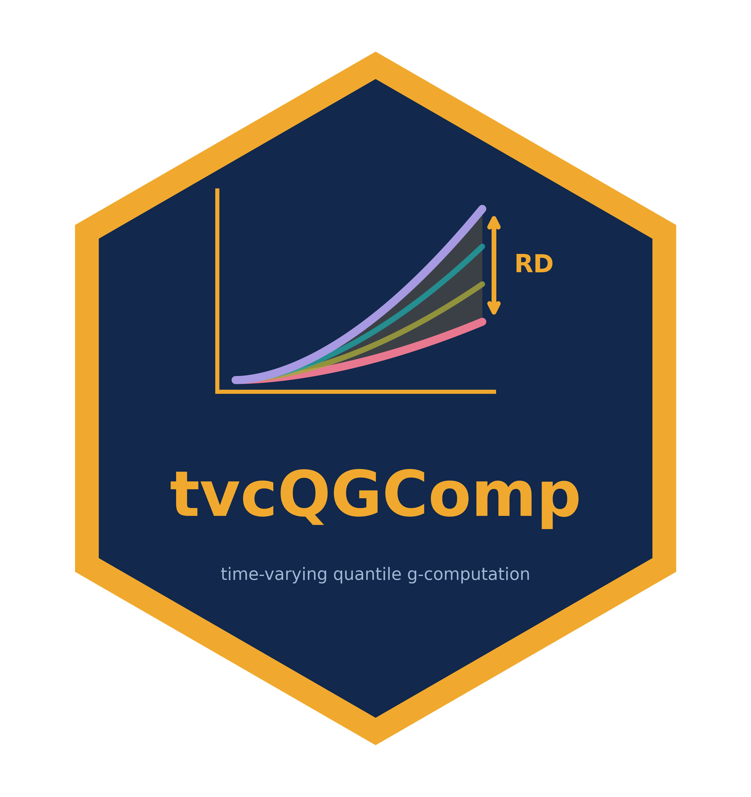

# tvcQGComp



Authors: Juwel Rana and Alexander Keil

## Dev Status

[](https://www.repostatus.org/#active)
[](https://github.com/JuwelRana19/tvcQGComp/actions/workflows/R-CMD-check.yaml)
[](https://lifecycle.r-lib.org/articles/stages.html#experimental)
[](https://github.com/JuwelRana19/tvcQGComp/releases)
[](https://github.com/JuwelRana19/tvcQGComp/releases)
[](https://app.codecov.io/gh/JuwelRana19/tvcQGComp)
[](https://www.codefactor.io/repository/github/JuwelRana19/tvcQGComp)

## Description

The main purpose of the `tvcQGComp` R-Package is to estimate joint
causal effects of time-varying exposure mixtures on survival or binary
outcomes. `tvcQGComp` provides time-varying quantile g-computation
workflows, including

- Monte Carlo skeleton generation
- automatic lag-history creation
- natural course prediction
- static intervention simulation
- pooled person-time or final-risk meta models
- cluster bootstrap confidence intervals

The implementation supports survival outcomes.

## Installation

Install the development version from GitHub with either `remotes` or
`pak`.

``` r

install.packages("remotes")
remotes::install_github("JuwelRana19/tvcQGComp")
```

``` r

install.packages("pak")
pak::pak("JuwelRana19/tvcQGComp")
```

## Documentation

The package website is generated with
[pkgdown](https://pkgdown.r-lib.org/). It provides a guided
introduction, an end-to-end analysis workflow with bootstrap and
diagnostic guidance, and searchable help pages for the complete public
API.

## Public API

- [`make_tvcqgcomp_config()`](https://JuwelRana19.github.io/tvcQGComp/reference/make_tvcqgcomp_config.md)
- [`validate_tvcqgcomp_data()`](https://JuwelRana19.github.io/tvcQGComp/reference/make_tvcqgcomp_config.md)
- [`generate_intervention_scenarios()`](https://JuwelRana19.github.io/tvcQGComp/reference/make_tvcqgcomp_config.md)
- [`make_q_scenarios()`](https://JuwelRana19.github.io/tvcQGComp/reference/make_tvcqgcomp_config.md)
- [`tvcQGComp_survival()`](https://JuwelRana19.github.io/tvcQGComp/reference/run_tvcqgcomp.md)
- [`tvcQGComp_survival_boot()`](https://JuwelRana19.github.io/tvcQGComp/reference/bootstrap_tvcqgcomp.md)
- [`summarize_tvcqgcomp_bootstrap()`](https://JuwelRana19.github.io/tvcQGComp/reference/bootstrap_tvcqgcomp.md)
- [`as_risk_curve_df()`](https://JuwelRana19.github.io/tvcQGComp/reference/as_risk_curve_df.md)
- [`plot_cumulative_risk_trajectory()`](https://JuwelRana19.github.io/tvcQGComp/reference/plot_cumulative_risk_trajectory.md)
  for the primary cumulative-incidence plot
- [`plot_survival_trajectory()`](https://JuwelRana19.github.io/tvcQGComp/reference/plot_survival_trajectory.md)
  for an optional survival plot
- [`diagnose_tvcqgcomp_run()`](https://JuwelRana19.github.io/tvcQGComp/reference/diagnose_tvcqgcomp_run.md)
- [`diagnose_tvcqgcomp_drift()`](https://JuwelRana19.github.io/tvcQGComp/reference/diagnose_tvcqgcomp_drift.md)
- [`plot_tvcqgcomp_drift()`](https://JuwelRana19.github.io/tvcQGComp/reference/plot_tvcqgcomp_drift.md)

## Reference Paper

> Rana, J., Keil, A. P., Chen, H., Chen, C., Hatzopoulou, M., Zalzal,
> J., Benmarhnia, T., & Kaufman, J. S. (2026). *Joint causal effects of
> time-varying traffic-related air pollution mixtures on nonaccidental
> mortality and environmental justice implications: A population-based
> cohort study in Toronto, Canada* \[Under Review\].

## Intended Scope

This release is intended for time-varying q-gcomp workflows where the
main user-facing tasks are:

1.  build a configuration object
2.  generate quantized intervention scenarios
3.  fit a survival analysis
4.  bootstrap the main effect estimates
5.  inspect trajectories and drift diagnostics

Version 0.0.0 is limited to quantized static scenarios and HR/RR/RD
main-effect meta-models. It does not include the development-package
helpers for raw lookup interventions, effect-measure modification,
subgroup-specific raw contrasts, or population-impact summaries.

## Minimal Example

``` r

library(tvcQGComp)

data("toy_data", package = "tvcQGComp")
dat <- toy_data
dat$TimeOut <- as.integer(as.character(dat$TimeOut))

exposures <- c("BC", "NIT", "SO4", "NH4", "OM")
active_tvc <- c(
  "Urban_form", "CanadianRegion", "CSize", "deprivation",
  "dependency", "instability", "ethnicconcentration"
)
baseline <- c(
  "age", "income_inadequacy", "sex", "visible_minority",
  "IndigenousIdentity", "marsth", "Education", "employment", "Occupation"
)

# These are formula term names only. auto_history creates the columns.
active_lag_terms <- paste0(active_tvc, "_lag1")
tvc_formulas <- setNames(lapply(active_tvc, function(response) {
  reformulate(
    c(
      "TimeOut", "I(TimeOut^2)", baseline,
      setdiff(active_lag_terms, paste0(response, "_lag1"))
    ),
    response = response
  )
}), active_tvc)

cfg <- make_tvcqgcomp_config(
  id = "UniqID",
  time_in = "TimeInn",
  time_out = "TimeOut",
  outcome = "status",
  exposures = exposures,
  time_varying_covariates = active_tvc,
  time_fixed_covariates = baseline,
  factor_vars = c(
    "income_inadequacy", active_tvc, baseline
  ),
  outcome_formula = reformulate(
    c(exposures, "TimeOut", "I(TimeOut^2)", baseline, active_tvc),
    response = "status"
  ),
  tvc_formulas = tvc_formulas,
  covtypes = c(
    setNames(rep("categorical", length(active_tvc)), active_tvc)
  ),
  q = 4,
  exposome = "quantized",
  natural_course = "calibration",
  auto_history = TRUE,
  baselags = TRUE,
  meta_target = c("HR", "RR", "RD")
)

scenarios <- generate_intervention_scenarios(cfg)

fit <- tvcQGComp_survival(
  data = dat,
  config = cfg,
  mc_size = 1000,
  intervention_scenarios = scenarios,
  seed = 1234
)

# Default printing focuses on model-based effects.
print(fit)

# Request time-specific risk and survival predictions only when needed.
print(fit, prediction = "trajectory")

# The primary plot is cumulative incidence by quantile.
plot_cumulative_risk_trajectory(
  fit,
  include_natural = FALSE,
  include_average = TRUE,
  legend_pos = "topleft"
)

# Draw survival curves only when they are needed.
plot_survival_trajectory(
  fit,
  include_natural = FALSE,
  include_average = TRUE
)

# Use larger values for final analyses.
boot <- tvcQGComp_survival_boot(
  data = dat,
  config = cfg,
  n_boot = 200,
  mc_size = 10000,
  intervention_scenarios = scenarios,
  seed = 1234,
  parallel = TRUE,
  n_workers = 1,
  batch_size = 1
)

summarize_tvcqgcomp_bootstrap(boot)
```

The complete, explicitly specified implementation is installed at
`system.file("examples", "simulated-survival-analysis.R", package = "tvcQGComp")`.
It includes the outcome model, all time-varying covariate models,
HR/RR/RD meta-models, parallel bootstrap settings, and code that
combines non-bootstrap point estimates with bootstrap percentile
confidence intervals. The bundled `toy_data` dataset contains 5,584
person-period records from 500 simulated individuals followed for 1 to
13 years. Exactly 100 participants die during follow-up, giving 20%
cumulative mortality. Its five exposures are continuous and are
quantized internally by the package. Lagged variables are deliberately
absent because `auto_history = TRUE` creates them during preparation. It
contains no real participant data. The same data are also available as
an RDS file at
`system.file("extdata", "toy_data_500.RDS", package = "tvcQGComp")`.

## Status

This package is distributed from GitHub. The public API is focused on
time-varying quantile g-computation workflows with survival outcomes.

## Development and Review

The package source code was developed and manually reviewed by the
authors. Additional code checks and refactoring support were performed
using Cursor and OpenAI Codex.
